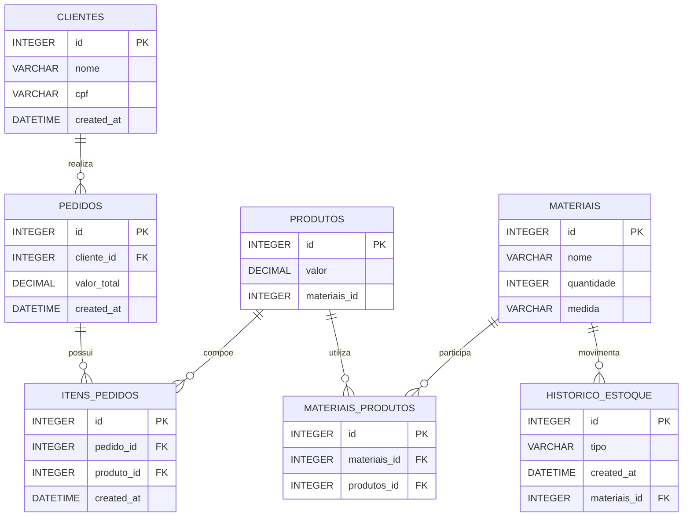

# Gestor de Vendas API

Este é o projeto **Gestor de Vendas**, uma API RESTful construída com .NET (C#) projetada para gerenciar as operações de vendas. A aplicação conta com uma estrutura organizada e utiliza um banco de dados SQL Server local, gerenciado via Docker, com o Flyway para versionamento das migrações do banco de dados.

## 🛠 Tecnologias Utilizadas

- **.NET (C#)**: Framework principal para a construção da Web API.
- **SQL Server 2022**: Banco de dados relacional (rodando em container).
- **Docker & Docker Compose**: Para orquestração dos containers do banco de dados e da ferramenta de migração.
- **Flyway**: Ferramenta utilizada para o controle de versão e migrações do banco de dados (lendo scripts da pasta `sql/`).

## 📁 Estrutura do Projeto

O projeto foi organizado de forma modular, com as seguintes pastas principais:

- `Controllers/`: Controladores da API responsáveis por receber as requisições HTTP e retornar as respostas.
- `Models/`: Classes que representam as entidades de domínio da aplicação.
- `DTOs/`: Objetos de Transferência de Dados (Data Transfer Objects) usados para trafegar dados com segurança entre o cliente e o servidor.
- `sql/`: Diretório que armazena os scripts SQL de criação de tabelas e inserção de dados, os quais são executados automaticamente pelo Flyway.
- `_specs/`: Contém documentações, decisões arquiteturais (ADR) e instruções padrões (skills) para o desenvolvimento.

## ⚙️ Pré-requisitos

Para rodar este projeto na sua máquina, garanta que você tenha as seguintes ferramentas instaladas:

- [SDK do .NET](https://dotnet.microsoft.com/download)
- [Docker](https://www.docker.com/get-started) e [Docker Compose](https://docs.docker.com/compose/install/)

Caso ainda não tenha sido populado crie dentro da api a estrutura de pastas:

```bash
.
├──Controllers
├──DTOs
├──Models
├──sql
```

usando

```bash
mkdir Controllers
mkdir DTOs
mkdir Models
mkdir sql
```

## 📝 Especificações, Skills e Decisões Arquiteturais

O repositório possui um padrão estruturado para documentar decisões de arquitetura e automatizar rotinas (skills padrões) dentro da pasta `_specs/`. Toda vez que for criar ou alterar funcionalidades, ou tomar decisões arquiteturais, siga este formato:

- `_specs/ADR/`: Diretório onde **todas** as Decisões Arquiteturais (Architectural Decision Records) devem ser documentadas.
- `_specs/cria_feature.md`: Instruções/skill padrão ensinando como criar uma nova feature no sistema.
- `_specs/altera_feature.md`: Instruções/skill padrão ensinando como alterar uma feature existente.
- `_specs/commands.md`: Arquivo para registrar comandos base do sistema, como por exemplo: acessar o banco de dados via `docker exec`, acessar os logs do backend usando docker, e outras informações sobre o funcionamento prático.

## 🚀 Como Executar o Projeto

Siga o passo a passo abaixo para configurar e iniciar a aplicação no seu ambiente de desenvolvimento:

### 1. Configurar as Variáveis de Ambiente

A aplicação e o banco de dados precisam de algumas configurações essenciais (como a senha do banco).
Faça uma cópia do arquivo de exemplo `.env.example` e crie um arquivo `.env` na raiz do projeto:

```bash
cp .env.example .env
```

Abra o arquivo `.env` gerado e defina uma senha forte para o banco de dados na variável `SA_PASSWORD`:

```env
ACCEPT_EULA=Y
SA_PASSWORD=SuaSenhaSuperForte123!
MSSQL_PID=Developer
```
*(Lembre-se: O SQL Server exige que a senha tenha letras maiúsculas, minúsculas, números e caracteres especiais).*

### 2. Subir o Banco de Dados

Com o Docker em execução na sua máquina, levante o serviço do banco de dados e execute as migrações (Flyway) utilizando o docker-compose. Na raiz do projeto, rode:

```bash
docker-compose up -d
```

*Isso fará com que o Docker inicie o SQL Server na porta `1433` e, em seguida, o Flyway aplique automaticamente qualquer script presente na pasta `sql/` dentro do banco `MeuBanco`.*

### 3. Iniciar a API

Agora que o banco de dados já está configurado e rodando, você pode iniciar o servidor da Web API.

Dentro da pasta do projeto, execute o comando:

```bash
dotnet run
```

A API será compilada e iniciada. O próprio terminal mostrará a URL base onde a aplicação está rodando (geralmente `http://localhost:5000` ou `https://localhost:5001`). Acesse essas URLs pelo seu navegador ou por uma ferramenta como Postman/Insomnia para testar os endpoints da sua API, ou acesse a rota do Swagger (ex: `http://localhost:5000/swagger`) se estiver configurado.


## DER do Projeto
